# Deploying App and MongoDB using Multiple VMs

This guide will explain how to deploy a MongoDB database server to serve the content for our sample web app.

Pre-requisites:

- Understand how to deploy a web app on an Nginx web server VM using Vagrant: [tech230-app-deployment](https://github.com/bradley-woods/tech230-app-deployment)
- Have your application and environment in a folder called 'app' and 'environment' respectively in the same directory as your 'Vagrantfile':

    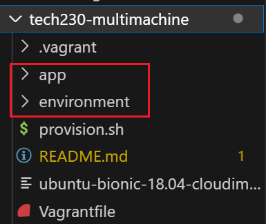

## Updating the Vagrantfile and Shell Script

1. Following on from the previous repository, which explained how to deploy our sample app, we need to first update the 'Vagrantfile' by adding a new `do` block to create another VM. We can then use one VM for serving the Nginx web app and the other for the MongoDB. Also, please be aware, we are now using an updated version of Ubuntu (bionic64). See below the new 'Vagrantfile':

    ```ruby
    # Configure 2 so that 2 virtual machines are created. Note, we need a new 'do' block. 'bionic64' is an Ubuntu 18.04 64-bit operating system.
    Vagrant.configure("2") do |config|

        config.vm.define "app" do |app|
            # configure the app VM settings
            app.vm.box = "ubuntu/bionic64"
            app.vm.network "private_network", ip:"192.168.10.100"

            # provision the VM to have nginx web server
            app.vm.provision "shell", path: "provision.sh", privileged: false

            # sync app folder from local machine to the VM
            app.vm.synced_folder "app", "/home/vagrant/app"
        end

        config.vm.define "db" do |db|
            # configure the db VM settings
            db.vm.box = "ubuntu/bionic64"
            db.vm.network "private_network", ip:"192.168.10.150"

            # sync environment folder from local machine to the VM
            db.vm.synced_folder "environment", "/home/vagrant/environment"
        end
    end
    ```

    > **Note:** the first block is to define the app VM where "app" is the folder that will be synced with the "/home/vagrant/app" directory in the app VM. The second block is to define the db (database) VM where "environment" is the folder that will be synced with the "/home/vagrant/environment" directory in the db VM. The IP for the db VM does not matter in this case, as long as it is on the same private network (192.168.10.XXX), in this case we used 192.168.10.150.

2. Now, we need to update our 'provision.sh' script because we do not want to run the app upon 'vagrant up'. Therefore, we need to comment out the last three commands. Also, since we are using `ubuntu/bionic64`, it needs nodeJS version 10 or later, so we need to change the curl command to `curl -sL https://deb.nodesource.com/setup_12.x` to get version 12 of node. The script should now look like the following:

    ```bash
    #!/bin/bash

    sudo apt-get update -y
    sudo apt-get upgrade -y

    # Install nginx web server
    sudo apt-get install nginx -y

    # Start nginx web server 
    sudo systemctl start nginx

    # Display nginx web server status to check it is running
    sudo systemctl status nginx

    # install app dependencies
    sudo apt-get install python-software-properties
    curl -sL https://deb.nodesource.com/setup_12.x | sudo -E bash -
    sudo apt-get install nodejs -y
    sudo npm install pm2 -g

    # install npm in app directory and run the app
    # cd app
    # npm install
    # node app.js
    ```

3. Let's start up our VMs using the following command ensuring we are in the correct directory, please note this will take some time to spin up both machines:

    ```console
    $ vagrant up
    ```

4. If all was successful, you should see two VMs running in Virtual Box manager or if you run the following command, you should see the state of each machine in the terminal window:

    ```console
    $ vagrant status
    ```

    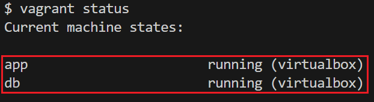

    > **Note:** you can see the name of each VM, one called 'app' for the sample application and the second called 'db' for our MongoDB database.

## Setting up MongoDB on the Second VM

1. Firstly, to set up MongoDB on our database VM, we need to log into it using a separate Git bash terminal and the following command, where `db` is the name of the specific VM:

    ```console
    $ vagrant ssh db
    ```

2. Similar to when we set up Nginx on the web server back in the introduction to Vagrant, we can use the following commands to fetch and install any packages for the VM:

    ```console
    $ sudo apt-get update -y
    $ sudo apt-get upgrade -y
    ```

3. We now need to download a key to trust MongoDB packages from key servers and add them to a trusted set of keys:

    ```console
    $ sudo apt-key adv --keyserver hkp://keyserver.ubuntu.com:80 --recv D68FA50FEA312927
    ```

    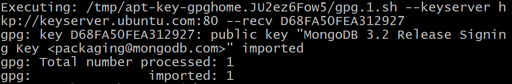

4. The downloaded key is then required to be read and stored in the MongoDB root repository using the following command:

    ```console
    $ echo "deb https://repo.mongodb.org/apt/ubuntu xenial/mongodb-org/3.2 multiverse" | sudo tee /etc/apt/sources.list.d/mongodb-org-3.2.list
    ```

5. We can run the same `update` and `upgrade` commands again to ensure we have installed everything before installing MongoDB:

    ```console
    $ sudo apt-get update -y
    $ sudo apt-get upgrade -y
    ```

6. To install MongoDB, use the following command:

    ```console
    $ sudo apt-get install -y mongodb-org=3.2.20 mongodb-org-server=3.2.20 mongodb-org-shell=3.2.20 mongodb-org-mongos=3.2.20 mongodb-org-tools=3.2.20
    ```

7. Next, we can now start the MongoDB server using the following command:

    ```console
    $ sudo systemctl start mongod
    ```

8. To create multiple versions of the database and allow multiple users to connect with it, we want to use the `enable` command. This also ensures the database is kept in a running state:

    ```console
    $ sudo systemctl enable mongod
    ```

    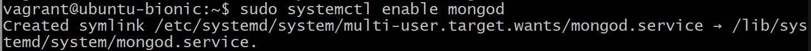

9. If all is successful, we can check the MongoDB database to see if it is running using the following command:

    ```console
    $ sudo systemctl status mongod
    ```

    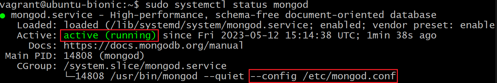

    > **Note:** see the configuration file `/etc/mongod.conf`, we will be editing this in the next step to establish a connection to the web app.

## Establishing Connection between the VMs

Since the web app we are running is dynamic it needs to communicate with the database server and pull data from it. 

1. To do this we first need to edit the MongoDB configuration file 'mongod.conf' using nano text editor:

    ```console
    $ sudo nano /etc/mongod.conf
    ```

    Once inside the editor, we need to change the network interface bind IP address to link up with the web app. However, in this case we can change it to 0.0.0.0 so any service can access it (WARNING: this is not advisable in a production environment). Also, you can see the default port number for MongoDB is 27017:

    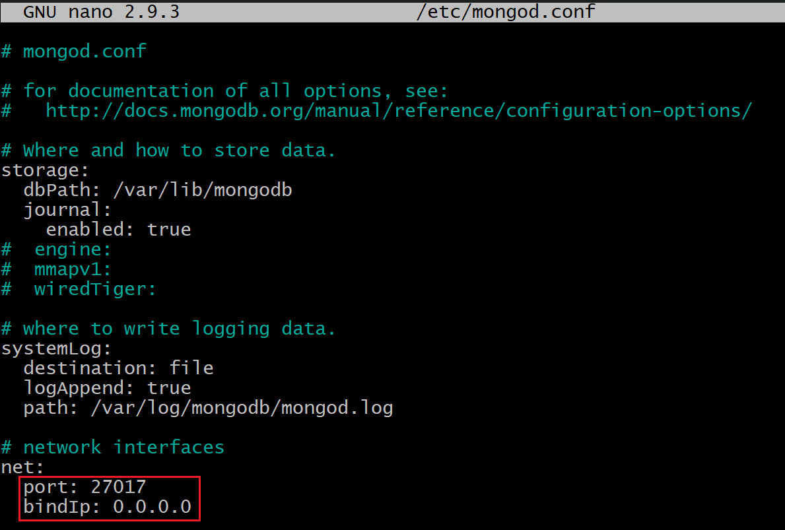

2. Now we have configured the IP address, let's restart our database using the `restart` followed by the `enable` command:

    ```console
    $ sudo systemctl restart mongod
    $ sudo systemctl enable mongod
    ```

    At this point, we can quickly check the mongoDB is up by entering the address we assigned to it and the default port number (192.168.10.150:27017):

    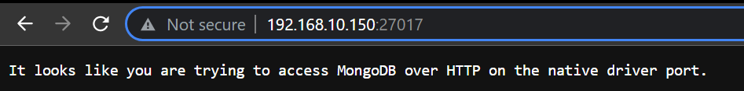

3. Next, we need to open a new Git bash terminal and log into the app VM using the following command:

    ```console
    $ vagrant ssh app
    ```

4. Now, we need to enter a global environment variable into '.bashrc' so any user/process can access it, and so it is run whenever the VM is launched. Enter the following command to open the file in nano editor:

    ```console
    $ sudo nano .bashrc
    ```

    Once inside, add the following line to the end of the script: `export DB_HOST=mongodb://192.168.10.150:27017/posts`. This tells the app where to locate the MongoDB database so it can retrieve the content from it, see the image below for detail of what '.bashrc' should look like.

    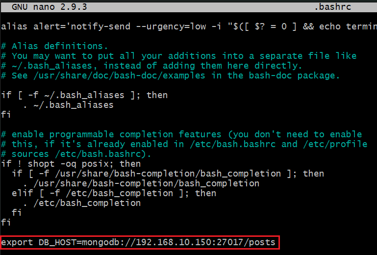

5. The next step is to read and execute the '.bashrc' file using the following command:

    ```console
    $ source .bashrc
    ```

6. Now we can go into the 'app' directory using `cd app` and run the command we previously commented out, as below to install node package manager:

    ```console
    app$ sudo npm install
    ```

    If you are presented with the following error, you will need to ensure the database is cleared and seeded by using the below command:

    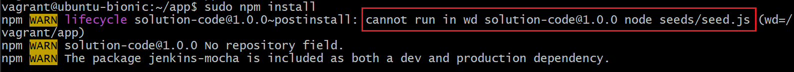

    ```console
    app$ node seeds/seed.js
    ```

7. Finally, we can run our app using the following command:

    ```console
    app$ node app.js
    ```

8.  If we enter the address for our web server and try to access the posts page using '192.168.10.100:3000/posts', we should be presented with content served by the MongoDB database VM.

    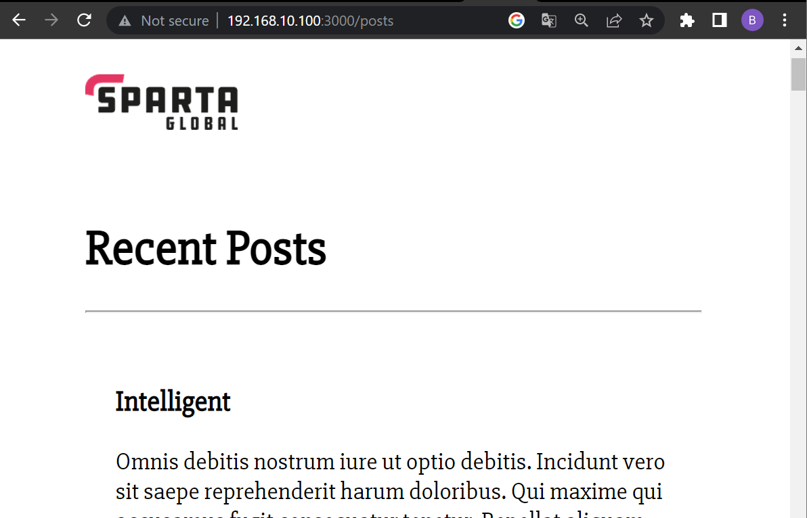

## Automating the MongoDB Deployment

1. We will now automate the previous steps of setting up our MongoDB VM by creating a shell script file 'provision_db.sh'. We want to ensure MongoDB is installed and started correctly using the previous steps outlined in this repository. The 'provision_db.sh' script should look similar to the below:

    ```bash
    #!/bin/bash

    sudo apt-get update -y
    sudo apt-get upgrade -y

    # Download key to trusted key set
    sudo apt-key adv --keyserver hkp://keyserver.ubuntu.com:80 --recv D68FA50FEA312927

    # The key is read and stored to MongoDB root repo
    echo "deb https://repo.mongodb.org/apt/ubuntu xenial/mongodb-org/3.2 multiverse" | sudo tee /etc/apt/sources.list.d/mongodb-org-3.2.list

    # Ensure all packages are installed prior to installing MongoDB
    sudo apt-get update -y
    sudo apt-get upgrade -y

    # Install MongoDB
    sudo apt-get install -y mongodb-org=3.2.20 mongodb-org-server=3.2.20 mongodb-org-shell=3.2.20 mongodb-org-mongos=3.2.20 mongodb-org-tools=3.2.20

    # Start and enable MongoDB
    sudo systemctl start mongod
    sudo systemctl enable mongod

    # Check status is running of the MongoDB server
    sudo systemctl status mongod
    ```

2. We now need to update our 'Vagrantfile' to add `db.vm.provision` line to call the new script 'provision_db.sh' file when the VM is started up.

    ```ruby
    # Configure 2 so that 2 virtual machines are created. Note, we need a new 'do' block. 'bionic64' is an Ubuntu 18.04 64-bit operating system.
    Vagrant.configure("2") do |config|

        config.vm.define "app" do |app|
            # configure the app VM settings
            app.vm.box = "ubuntu/bionic64"
            app.vm.network "private_network", ip:"192.168.10.100"

            # provision the VM to have nginx web server
            app.vm.provision "shell", path: "provision_app.sh", privileged: false

            # sync app folder from local machine to the VM
            app.vm.synced_folder "app", "/home/vagrant/app"
        end

        config.vm.define "db" do |db|
            # configure the db VM settings
            db.vm.box = "ubuntu/bionic64"
            db.vm.network "private_network", ip:"192.168.10.150"

            # provision the VM to have MongoDB database
            db.vm.provision "shell", path: "provision_db.sh", privileged: false

            # sync environment folder from local machine to the VM
            db.vm.synced_folder "environment", "/home/vagrant/environment"
        end
    end
    ```

    > **Note:** the provision script for the app was renamed to 'provision_app.sh' for clarity.

3. Proceed by running the `vagrant up` command. Wait until everything installs and both VMs are running (this may take some time). Once everything is finished, the final few lines in the terminal should state the MongoDB service is active and running, as below:

    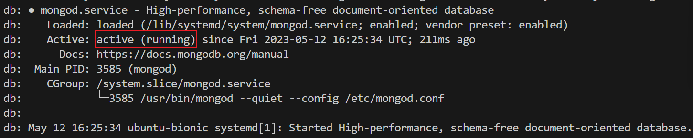

## Automating the Connection between VMs

We will now look into automating the steps above for establishing a connection between the VMs by editing the configuration files automatically on `vagrant up`.

### Database Server

1. Firstly, we need to add to the shell script 'provision_db.sh`, so it can automatically edit the 'mongod.conf' configuration file to change the 'bindIp' address from local 127.0.0.1 to open 0.0.0.0, we can use the following sed command, then we just need to restart and reenable the MongoDB server. Our 'provision_db.sh' script should now look similar to the following:

    ```bash
    #!/bin/bash

    sudo apt-get update -y
    sudo apt-get upgrade -y

    # Download key to trusted key set
    sudo apt-key adv --keyserver hkp://keyserver.ubuntu.com:80 --recv D68FA50FEA312927

    # The key is read and stored to MongoDB root repo
    echo "deb https://repo.mongodb.org/apt/ubuntu xenial/mongodb-org/3.2 multiverse" | sudo tee /etc/apt/sources.list.d/mongodb-org-3.2.list

    # Ensure all packages are installed prior to installing MongoDB
    sudo apt-get update -y
    sudo apt-get upgrade -y

    # Install MongoDB
    sudo apt-get install -y mongodb-org=3.2.20 mongodb-org-server=3.2.20 mongodb-org-shell=3.2.20 mongodb-org-mongos=3.2.20 mongodb-org-tools=3.2.20

    # Start and enable MongoDB
    sudo systemctl start mongod
    sudo systemctl enable mongod

    # Check status is running of the MongoDB server
    sudo systemctl status mongod

    # Edit /etc/mongod.conf file to change bindIp to 0.0.0.0
    sudo sed -i "s,\\(^[[:blank:]]*bindIp:\\) .*,\\1 0.0.0.0," /etc/mongod.conf

    # Restart then enable MongoDB
    sudo systemctl restart mongod
    sudo systemctl enable mongod
    ```

2. That should bring up the MongoDB server and configure the network interface automatically meaning we do not have to log in to the Database VM.

### Application Server

1. Similar to the database server, we can add to our application shell script 'provision_app.sh', to automatically add the host IP environment variable command to `.bashrc` using the echo command with the -a flag to append to the `.bashrc` file instead of replacing it. The 'provision_app.sh' script should look similar to the following:

    ```bash
    #!/bin/bash

    sudo apt-get update -y
    sudo apt-get upgrade -y

    # Install nginx web server
    sudo apt-get install nginx -y

    # Start nginx web server 
    sudo systemctl start nginx

    # Display nginx web server status to check it is running
    sudo systemctl status nginx

    # Install app dependencies
    sudo apt-get install python-software-properties
    curl -sL https://deb.nodesource.com/setup_12.x | sudo -E bash -
    sudo apt-get install nodejs -y
    sudo npm install pm2 -g

    # Add database host IP info to .bashrc
    echo -e "\nexport DB_HOST=mongodb://192.168.10.150:27017/posts" | sudo tee -a .bashrc
    source .bashrc

    # Install npm in app directory and run the app
    cd app
    npm install
    node seeds/seed.js
    node app.js
    ```

2. That should automatically configure the '.bashrc' file and reload it on the application VM meaning we do not have to log in to the application VM to manually change this.
